# Diagram Architektury UI - Aplikacja Memo

**Data utworzenia:** 2026-01-29  
**Wersja:** 1.0  
**Typ:** Architektura komponentów UI i przepływ danych

## Opis

Diagram przedstawia kompletną architekturę interfejsu użytkownika aplikacji Memo, ze szczególnym uwzględnieniem modułu autentykacji. Wizualizuje:

- Strukturę stron (SSR Astro)
- Komponenty interaktywne (React)
- Endpointy API
- Serwisy i helpery
- Przepływ danych między komponentami
- Integrację z zewnętrznymi usługami (Supabase, OpenRouter)

### Legenda kolorów:

- **Niebieski** - Strony publiczne (landing, auth flow)
- **Pomarańczowy** - Strony chronione (wymagające autentykacji)
- **Różowy** - Komponenty React związane z autentykacją
- **Fioletowy** - Komponenty React związane z listami
- **Zielony** - Endpointy API
- **Żółty** - Serwisy i helpery
- **Brązowy** - Zewnętrzne usługi
- **Turkusowy** - Layouty Astro

## Diagram

```mermaid
flowchart TD
    subgraph "Layouts"
        L1[Layout]
        L2[MainLayout]
        L3[FocusLayout]
    end

    subgraph "Strony Publiczne - SSR"
        P1[index.astro]
        P2[auth/check-email.astro]
        P3[auth/callback.astro]
    end

    subgraph "Strony Chronione - SSR"
        P4[dashboard.astro]
        P5[profile.astro]
        P6[lists/new.astro]
        P7[lists/id.astro]
        P8[lists/id/test.astro]
    end

    subgraph "Komponenty Auth - React"
        C1[AuthForm]
        C2[CheckEmailContent]
        C3[UserMenu]
        C4[DeleteAccountDialog]
    end

    subgraph "Komponenty List - React"
        C5[ListCreator]
        C6[AiGeneratorForm]
        C7[ManualPasteFormWrapper]
        C8[ModeSegmentedControl]
        C9[TestRunner]
        C10[QuestionCard]
        C11[WordListItem]
    end

    subgraph "Komponenty Wspólne - Astro"
        C12[HeroSection]
        C13[Navigation]
        C14[DashboardGrid]
        C15[ProfileStats]
    end

    subgraph "Komponenty Wspólne - React"
        C16[ThemeToggle]
        C17[QuotaIndicator]
    end

    subgraph "API Endpoints Auth"
        A1[POST /api/auth/send-magic-link]
        A2[POST /api/auth/logout]
        A3[DELETE /api/auth/delete-account]
    end

    subgraph "API Endpoints Lists"
        A4[POST /api/ai/generate-list]
        A5[POST /api/lists]
        A6[GET/PATCH/DELETE /api/lists/id]
    end

    subgraph "Services i Helpers"
        S1[middleware/index.ts]
        S2[auth-helpers.ts]
        S3[rate-limiter.ts]
        S4[supabase.client.ts]
        S5[ai-generator.ts]
    end

    subgraph "External Services"
        E1[Supabase Auth]
        E2[Supabase Database]
        E3[OpenRouter AI]
    end

    %% Przepływ Auth - Landing Page
    P1 -->|używa| L1
    P1 -->|renderuje| C12
    P1 -->|renderuje| C1
    C1 -->|POST request| A1
    A1 -->|wysyła OTP| E1
    A1 -->|sprawdza limit| S3
    E1 -->|wysyła email| USER[User Email]

    %% Przepływ Auth - Check Email
    A1 -->|redirect success| P2
    P2 -->|używa| L1
    P2 -->|renderuje| C2
    C2 -->|resend| A1

    %% Przepływ Auth - Callback
    USER -->|klika link| P3
    P3 -->|wymienia code| E1
    P3 -->|tworzy profil| S2
    P3 -->|zapisuje sesję| E2
    P3 -->|redirect| P4

    %% Middleware
    S1 -->|sprawdza sesję| E1
    S1 -->|inject user| P4
    S1 -->|inject user| P5
    S1 -->|inject user| P6
    S1 -->|inject user| P7
    S1 -->|inject user| P8

    %% Dashboard
    P4 -->|używa| L2
    P4 -->|renderuje| C3
    P4 -->|renderuje| C13
    P4 -->|renderuje| C14
    P4 -->|pobiera dane| E2

    %% Profile
    P5 -->|używa| L2
    P5 -->|renderuje| C3
    P5 -->|renderuje| C15
    P5 -->|renderuje| C16
    P5 -->|renderuje| C4
    C3 -->|logout| A2
    C4 -->|delete account| A3
    A2 -->|signOut| E1
    A3 -->|delete user| E1
    A3 -->|cascade delete| E2

    %% List Creator
    P6 -->|używa| L2
    P6 -->|renderuje| C5
    C5 -->|zawiera| C8
    C5 -->|tryb AI| C6
    C5 -->|tryb Manual| C7
    C6 -->|generuje| A4
    A4 -->|używa| S5
    A4 -->|wywołuje| E3
    C5 -->|zapisuje| A5
    A5 -->|tworzy listę| E2

    %% List Detail
    P7 -->|używa| L2
    P7 -->|renderuje| C11
    P7 -->|pobiera dane| E2

    %% Test
    P8 -->|używa| L3
    P8 -->|renderuje| C9
    C9 -->|renderuje| C10
    C9 -->|zapisuje wynik| A6
    A6 -->|update| E2

    %% MainLayout dependencies
    L2 -->|zawiera| C3
    L2 -->|zawiera| C13
    L2 -->|zawiera| C17

    %% Helpers usage
    S2 -->|używa| S4
    A1 -->|używa| S3
    A2 -->|używa| S2
    A3 -->|używa| S2
    P3 -->|używa| S2

    %% Styling
    classDef pagePublic fill:#e1f5ff,stroke:#0288d1,stroke-width:2px
    classDef pageProtected fill:#fff3e0,stroke:#f57c00,stroke-width:2px
    classDef reactAuth fill:#fce4ec,stroke:#c2185b,stroke-width:2px
    classDef reactList fill:#f3e5f5,stroke:#7b1fa2,stroke-width:2px
    classDef api fill:#e8f5e9,stroke:#388e3c,stroke-width:2px
    classDef service fill:#fff9c4,stroke:#f9a825,stroke-width:2px
    classDef external fill:#efebe9,stroke:#5d4037,stroke-width:2px
    classDef layout fill:#e0f2f1,stroke:#00897b,stroke-width:2px

    class P1,P2,P3 pagePublic
    class P4,P5,P6,P7,P8 pageProtected
    class C1,C2,C3,C4 reactAuth
    class C5,C6,C7,C8,C9,C10,C11 reactList
    class A1,A2,A3,A4,A5,A6 api
    class S1,S2,S3,S4,S5 service
    class E1,E2,E3,USER external
    class L1,L2,L3 layout
```



## Kluczowe Przepływy

### 1. Przepływ Autentykacji (Magic Link)

```
User → index.astro → AuthForm → POST /api/auth/send-magic-link → Supabase Auth → Email
                                                                        ↓
Email Link → auth/callback.astro → Exchange code → Create profile → Set session → Redirect dashboard.astro
```

### 2. Przepływ Tworzenia Listy (AI)

```
User → lists/new.astro → ListCreator → ModeSegmentedControl (AI) → AiGeneratorForm
                                                                          ↓
                                                              POST /api/ai/generate-list
                                                                          ↓
                                                                  OpenRouter AI
                                                                          ↓
                                                              Draft Preview
                                                                          ↓
                                                              POST /api/lists
                                                                          ↓
                                                              Supabase Database
                                                                          ↓
                                                              Redirect /lists/[id]
```

### 3. Przepływ Middleware (Session Check)

```
Request → middleware/index.ts → getSession() → Supabase Auth
                    ↓
          isSessionActive() → Supabase Database
                    ↓
          Inject user to Astro.locals
                    ↓
          Continue to page/API
```

### 4. Przepływ Wylogowania

```
User → UserMenu (click) → POST /api/auth/logout → Invalidate session → Supabase Auth
                                                                              ↓
                                                                    Clear cookies
                                                                              ↓
                                                                    Redirect /
```

### 5. Przepływ Usuwania Konta

```
User → profile.astro → DeleteAccountDialog → Input "USUŃ" → DELETE /api/auth/delete-account
                                                                          ↓
                                                                  Validate confirmation
                                                                          ↓
                                                                  Delete user (cascade)
                                                                          ↓
                                                                  Supabase Auth + Database
                                                                          ↓
                                                                  Redirect /?deleted=true
```

## Komponenty Do Utworzenia

Zgodnie z specyfikacją auth-spec.md, następujące elementy wymagają utworzenia:

### Strony:

- [ ] `src/pages/auth/check-email.astro` - Strona potwierdzenia wysłania linku
- [ ] `src/pages/auth/callback.astro` - Handler callback po kliknięciu magic link

### Komponenty React:

- [ ] `src/components/AuthForm.tsx` - Konwersja z AuthForm.astro na React
- [ ] `src/components/CheckEmailContent.tsx` - Countdown timer i resend

### API Endpoints:

- [ ] `src/pages/api/auth/send-magic-link.ts` - Wysyłka magic link
- [ ] `src/pages/api/auth/logout.ts` - Wylogowanie
- [ ] `src/pages/api/auth/delete-account.ts` - Usunięcie konta

### Services:

- [ ] `src/lib/auth-helpers.ts` - Reusable funkcje autoryzacji
- [ ] `src/lib/services/rate-limiter.ts` - Rate limiting logic

## Komponenty Do Aktualizacji

### Wymagające zmian:

- [ ] `src/pages/index.astro` - Obsługa error params z callback
- [ ] `src/components/UserMenu.tsx` - Aktualizacja logout handlera
- [ ] `src/components/DeleteAccountDialog.tsx` - Integracja z API endpoint
- [ ] `src/middleware/index.ts` - Session validation + invalidation check

## Zależności między Modułami

### Moduł Auth → Cała Aplikacja

- `middleware/index.ts` chroni wszystkie strony wymagające autentykacji
- `UserMenu` używany w `MainLayout` (dostępny na wszystkich chronionych stronach)
- `auth-helpers.requireAuth()` wywoływany na początku chronionych stron

### Moduł List → Moduł Auth

- Wszystkie strony list wymagają autentykacji
- `ListCreator` wymaga `user_id` z sesji
- Quota indicator wymaga informacji o użytkowniku

### Komponenty Wspólne → Wszystkie Moduły

- `MainLayout` używany przez chronione strony (dashboard, profile, lists)
- `Navigation` dostępna we wszystkich chronionych stronach
- `ThemeToggle` dostępny w `MainLayout` i jako standalone

## Notatki Implementacyjne

### Hybrid Rendering Strategy:

- **Astro (SSR)**: Strony, layouty, sprawdzanie sesji, routing
- **React (CSR)**: Formularze, interaktywność, lokalne stany

### State Management:

- **Server State**: `Astro.locals.user`, session cookies (Supabase Auth)
- **Client State**: React `useState`, `useEffect` dla formularzy i UI
- **Browser Storage**: `localStorage` dla theme preference

### Security Layers:

1. **Middleware**: Session validation dla każdego requestu
2. **Rate Limiter**: IP + email based limiting dla auth endpoints
3. **Session Tracking**: Custom `user_sessions` table dla invalidacji
4. **CSRF Protection**: `SameSite` cookies + Supabase built-in

### Performance Considerations:

- Astro islands dla selektywnej hydratacji React komponentów
- `client:load` dla krytycznych komponentów (formularze, menu)
- Static rendering dla publicznych stron
- SSR dla chronionych stron (fresh session check)

---

**Koniec diagramu**
